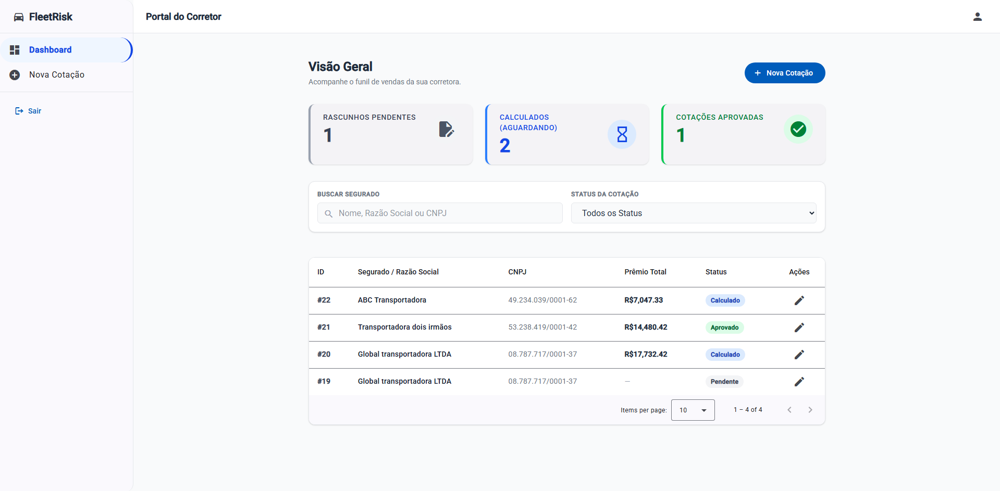
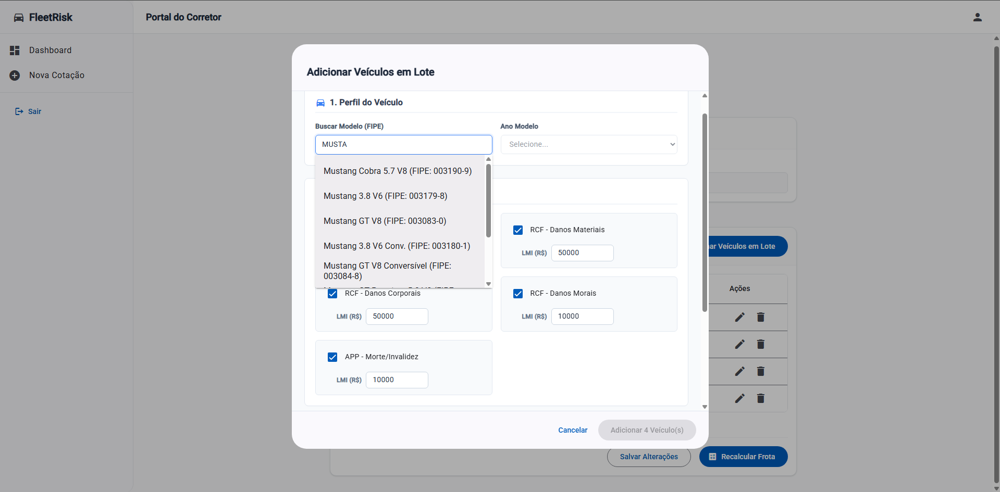
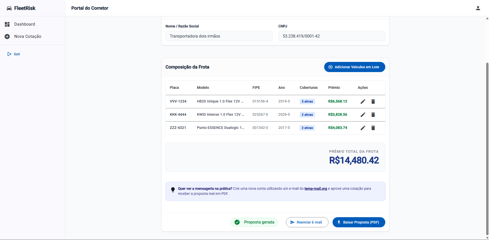
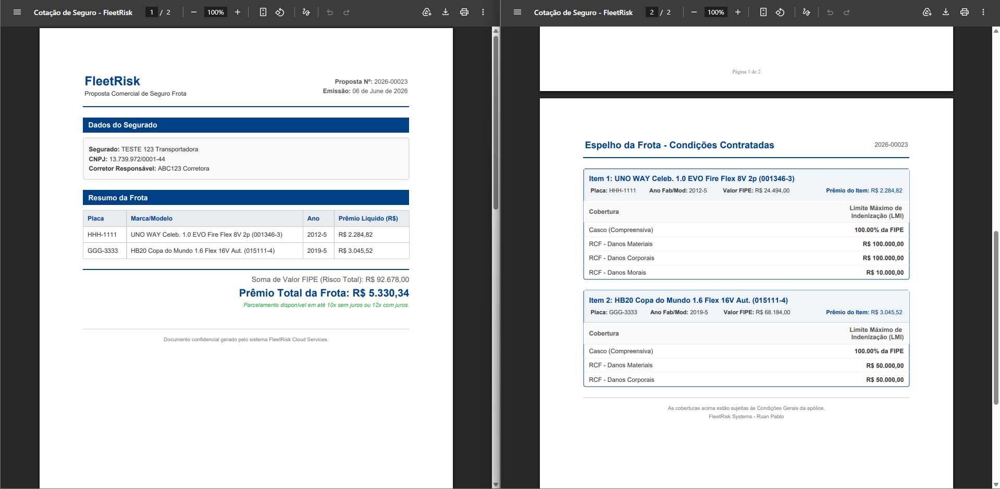
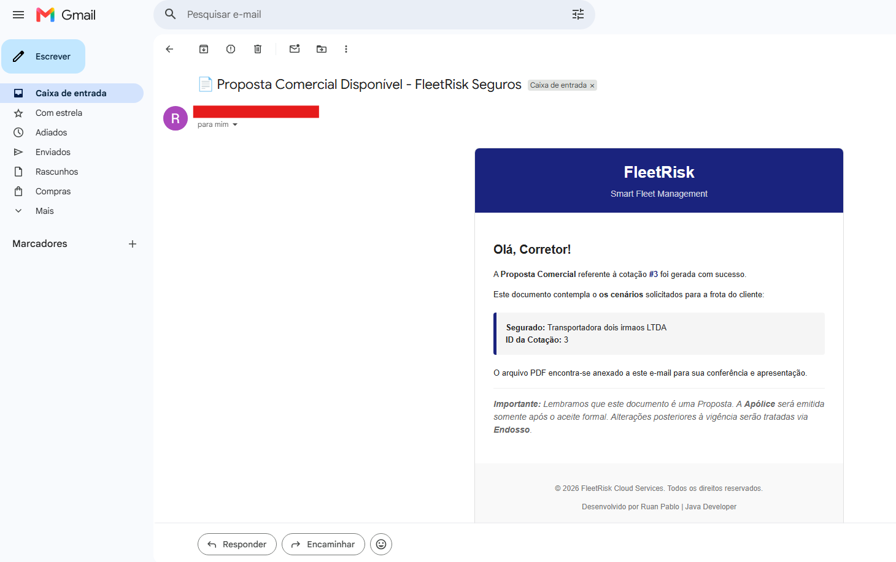

# 🚗 FleetRisk Web Interface


O **FleetRisk Web** é o frontend principal do ecossistema de subscrição de seguros para frotas comerciais. Desenvolvido como uma Single Page Application (SPA) de alta performance utilizando Angular 19, o sistema oferece à corretora uma experiência fluida para precificação de frotas, suportada por WebSockets, arquitetura orientada a eventos e um design focado na conversão e produtividade do usuário.

---

## 🚀 Acesse o projeto em produção

- **Aplicação Front-end:** https://fleetrisk.netlify.app/login

- **Documentação da API (Swagger):** https://fleetrisk-ruanpablo2.duckdns.org/swagger-ui/index.html

## 🔥 Highlights Técnicos (diferenciais do projeto)

- **Zero-Friction Demo:** Interface de login projetada com a funcionalidade One-Click Demo, permitindo que recrutadores e avaliadores técnicos testem o sistema instantaneamente sem a necessidade de preencher formulários de cadastro.

- - **Modelagem Granular e Reidratação de Dados:** Formulários reativos projetados para lidar com a complexidade de múltiplas coberturas (Casco, RCF, APP). Através da _reidratação de dados_, o corretor pode destravar e editar frotas já aprovadas sem perder o progresso, recuperando os dados instantaneamente na interface para alterações cirúrgicas.

- **UX Educativa:** Banners contextuais integrados na interface (como a dica de uso do Temp-Mail) que guiam o avaliador a testar as integrações assíncronas do backend (envio de e-mails via RabbitMQ) diretamente pela UI.

- **Mobile-First & Layout Adaptativo:** Utilização do `BreakpointObserver` do Angular CDK para transformar dinamicamente a barra de navegação em uma gaveta flutuante (`drawer`) em dispositivos móveis. Tabelas densas de dados atuariais foram otimizadas com rolagem horizontal contida, garantindo que o painel da corretora seja 100% responsivo em qualquer formato de tela.

- **Conexão Real-Time Resiliente:** Integração do cliente STOMP com SockJS para garantir que a conexão WebSocket "cave um túnel" HTTP seguro por debaixo de proxies reversos e API Gateways da nuvem, garantindo atualizações de prêmio na tela sem falhas de CORS.

## 🚀 Funcionalidades Principais & UX

### 🔒 Autenticação e Multi-Tenancy (Isolamento)

- **Sessão Segura:** Autenticação baseada em JWT com injeção automática em cabeçalhos via `HttpInterceptor`.
- **Tenant Isolation:** A interface garante que o corretor visualize e manipule apenas os dados atrelados ao seu próprio CNPJ, validado pelo Gateway.
- **Proteção de Rotas:** Utilização de `AuthGuard` acoplado ao Angular Router para blindar áreas internas do sistema.

### 📊 Painel de Controle (Dashboard)

- **Visão Gerencial (KPIs):** Indicadores em tempo real do funil de vendas (Pendentes, Calculados e Aprovados).
- **Busca Otimizada:** Tabela de cotações com pesquisa reativa (Nome/CNPJ e Status). Utiliza `debounceTime` e `distinctUntilChanged` do RxJS para poupar recursos do servidor e realizar buscas apenas quando o usuário pausa a digitação.

### ⚙️ Motor Atuarial em Tempo Real (WebSockets)

- **Single Page Form:** UX comercial otimizada. Os dados do cliente e a montagem da frota dividem a mesma tela para evitar cliques desnecessários.
- **Integração FIPE:** Autocomplete inteligente com base na tabela FIPE para busca de modelos de veículos e captura de anos disponíveis.
- **Precificação Assíncrona:** O cálculo de prêmio é processado em background pelo backend via RabbitMQ. O frontend escuta o tópico via **WebSocket (STOMP)** e atualiza a tela automaticamente (reatividade instantânea) sem necessidade de refresh.

### 📄 Emissão e Pós-Venda

- Geração de propostas comerciais (PDFs) consumidas diretamente do serviço de Documentos como `Blob`.
- Disparo manual de e-mails para envio de propostas ao cliente.

---

## 🛠️ Stack Tecnológica

- **Framework:** [Angular 19](https://angular.dev/) (Utilizando Standalone Components, Control Flow `@if/@for` e Signals).
- **Gestão de Estado:** Signals e RxJS para fluxos de dados assíncronos.
- **Estilização:** SCSS modular combinado com utilitários **Tailwind CSS** (`@apply`) para design responsivo e componentes do **Angular Material** (Tabelas, Inputs, Spinners).
- **Mensageria Real-Time:** `@stomp/stompjs` para comunicação WebSocket.

---

## 📂 Arquitetura do Projeto (DDD)

A estrutura segue o padrão Domain-Driven Design adaptado para Angular, garantindo escalabilidade e separação de responsabilidades:

```text
src/app/
 ┣ 📂 core/                # Coração da aplicação (Singleton)
 ┃ ┣ 📂 guards/            # Proteção de rotas (AuthGuard).
 ┃ ┣ 📂 interceptors/      # Manipulação de requisições (Injeção de JWT).
 ┃ ┗ 📂 services/          # Serviços globais (WebSocketService, AuthService).
 ┣ 📂 features/            # Domínios de Negócio (Lazy Loaded)
 ┃ ┣ 📂 auth/              # Telas de Login e Registro de Corretoras.
 ┃ ┗ 📂 quotes/            # Funcionalidades principais:
 ┃   ┣ 📂 dashboard/       # Lista de cotações, KPIs e filtros reativos.
 ┃   ┣ 📂 quote-create/    # Tela inteligente para abertura de rascunhos.
 ┃   ┗ 📂 quote-edit/      # Single Page Form, Autocomplete FIPE, WebSockets e Emissão PDF.
 ┗ 📜 app.routes.ts        # Mapeamento de rotas e injeção do layout logado.
```

---

## 📸 Demonstração

Esta seção apresenta a interface visual do FleetRisk.

<div align="center">
  <h3>Interface do Sistema</h3>
  <p align="center">
    
  </p>
  <br>
  <table width="100%">
    <tr>
      <td width="50%" align="center">
        <b>Autocomplete de veículos</b><br>
        
      </td>
      <td width="50%" align="center">
        <b>Cotação aprovada</b><br>
        
      </td>
    </tr>
  </table>

<br><br>

  <h3>Proposta em PDF e notificação</h3>
  <p align="center">
    <b>Proposta em PDF</b><br>
    
  </p>
  
  <br>

  <p align="center">
    <b>E-mail de notificação de cotação</b><br>
    
  </p>
</div>

---

## ⚙️ Configuração e Instalação

Siga os passos abaixo para rodar o frontend em sua máquina local.

1.  **Clone o repositório:**

```
 git clone [https://github.com/RuanPablo2/fleet-risk-web.git](https://github.com/RuanPablo2/fleet-risk-web.git)
 cd fleet-risk-web
```

2.  **Instale as dependências:**

```
npm install
```

3.  **Configure o Ambiente:**
    O projeto utiliza arquivos de environment para gerenciar a URL da API. Altere o arquivo `src/environments/environment.ts` para apontar para o seu API Gateway local:

```typescript
export const environment = {
  production: false,
  apiUrl: "http://localhost:8080/api/v1",
};
```

4.  **Execute o Servidor de Desenvolvimento:**

```bash
  ng serve
```

Após o build, a aplicação estará disponível em `http://localhost:4200`.

---

### 🔄 Tratamento de Rotas SPA

Como o Angular é uma Single Page Application (SPA), configuramos uma regra de redirecionamento para evitar erros 404 ao atualizar páginas internas. O arquivo `public/_redirects` contém:

```text
/* /index.html  200
```

---

## 👨‍💻 Autor

Desenvolvido por Ruan Pablo (https://github.com/RuanPablo2). Feedbacks e contribuições são bem-vindos!
